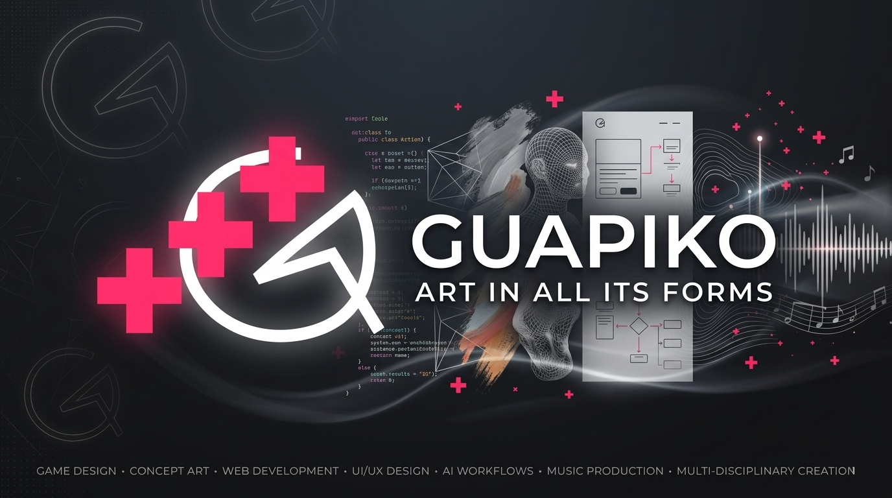

<!--
  This is a premium, visual-first GitHub Profile README.
  Designed with cyber-dark aesthetics, balanced spacing, and harmonized neon accents.
  To customize, replace "Thegod322" with your details and update links as needed.
-->

  
  <!-- Cyberpunk/Minimalist Header Banner -->
  

   

  <!-- Tagline & Intro -->
  <h3>💫 I turn imagination into reality — if you can imagine it, you can build it.</h3>
  
  

    
  

  <!-- Modern Social/Stat Badges with sleek custom palettes -->
  

    
    
    
  

### 🌌 Beyond the Code

Hello! I am a game designer, web developer, and automation engineer focused on turning ideas into real experiences. I enjoy building interactive products, creating modern web applications, and automating workflows that save time and scale smoothly.

- 🔭 **Current Focus:** Designing creative digital experiences, building web products, and automating repetitive processes.
- ⚡ **Strengths:** Connecting ideas with execution, improving workflows, and building practical solutions.
- 🧪 **Philosophy:** "If you can imagine it, you can build it."

---

### 🛠️ Tech Stack & Arsenal

  
  #### 🎮 Game Development & Interactive Worlds
  

    
    
    
    
    
  

  #### 💻 Languages & Runtimes
  

    
    
    
    
    
    
    
  

  #### 🌐 Frameworks & Frontend
  

    
    
    
    
    
  

  #### 🎨 Creative & Design
  

    
    
  

  #### 🗄️ Databases, Cloud & DevOps
  

    
    
    
    
  

  

---

### 📊 GitHub Activity

  <picture>
    <source media="(prefers-color-scheme: dark)" srcset="https://github-readme-streak-stats.herokuapp.com/?user=Thegod322&theme=tokyonight&hide_border=true"/>
    <source media="(prefers-color-scheme: light)" srcset="https://github-readme-streak-stats.herokuapp.com/?user=Thegod322&theme=default&hide_border=true"/>
    
  </picture>

 

---

### 💬 Connect & Collaborate

  
<b>Open to collaborations in game development, web experiences, automation, and creative technology.</b>

  

     &nbsp;&nbsp;
     &nbsp;&nbsp;
    
  

